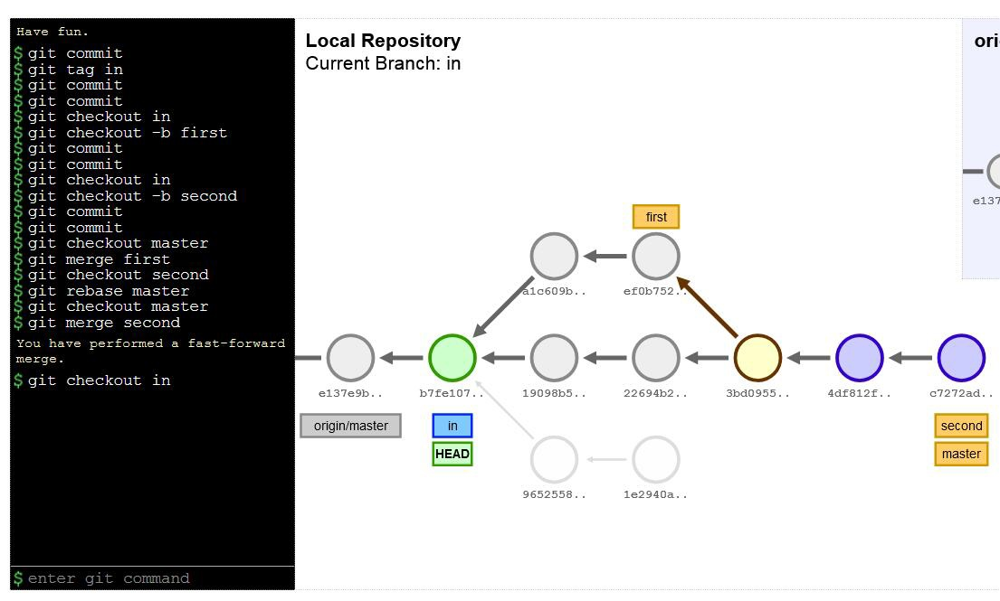
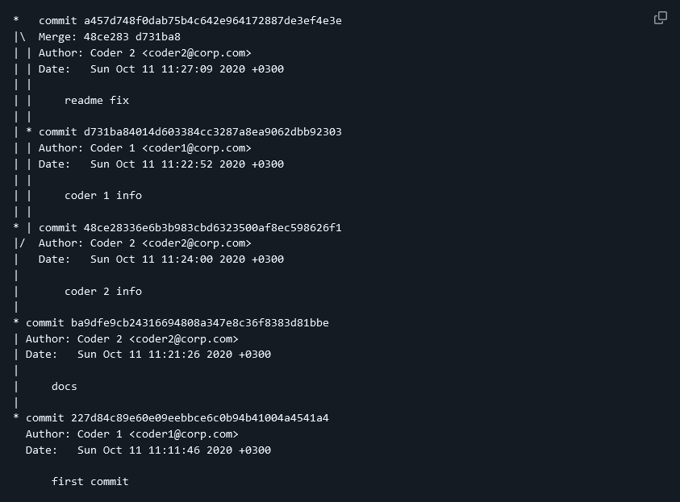
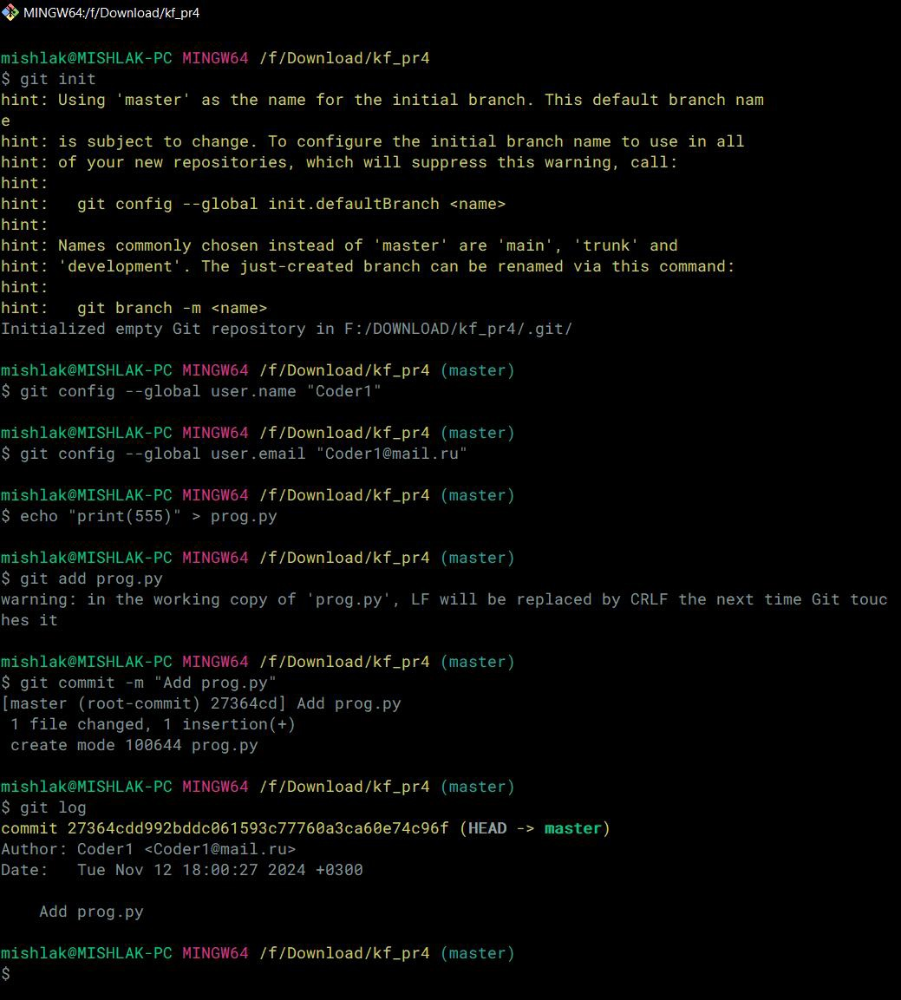
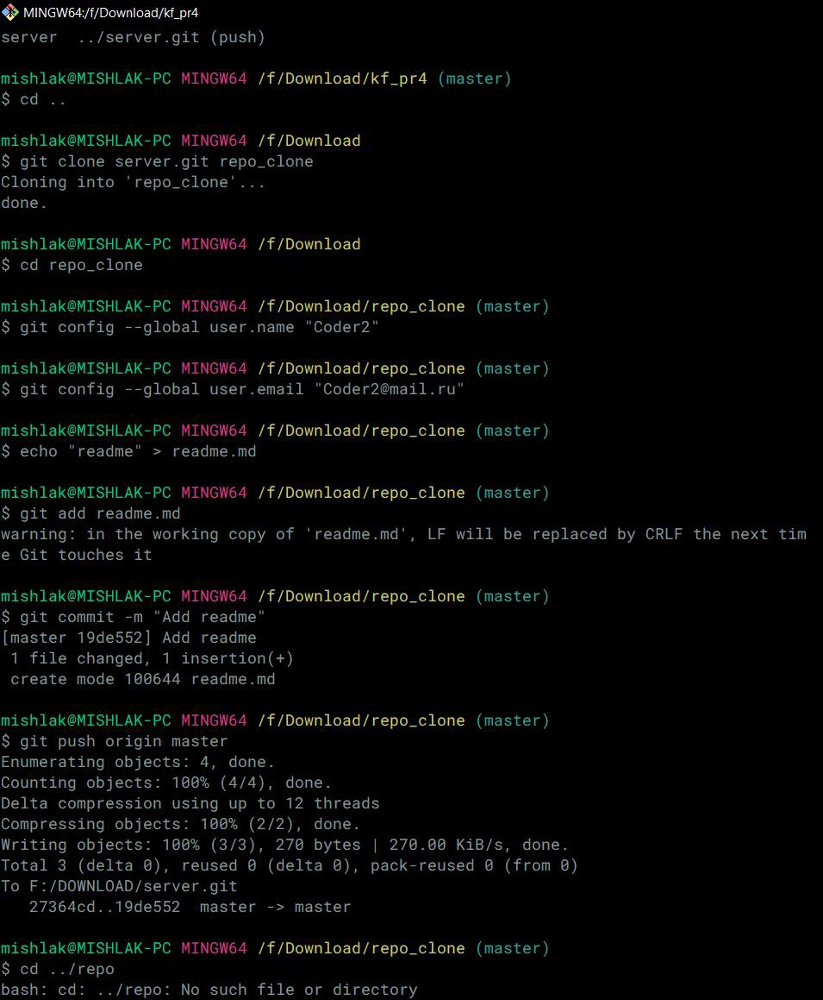
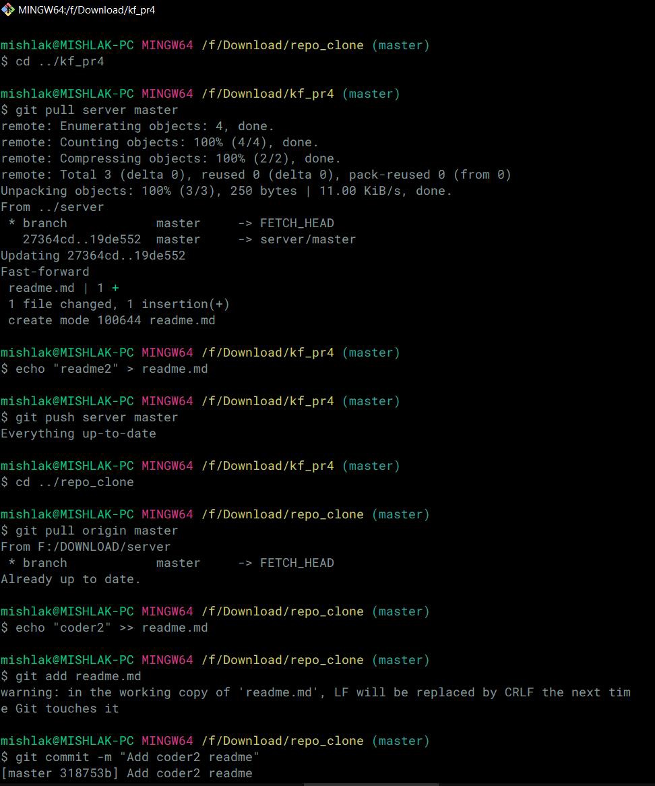
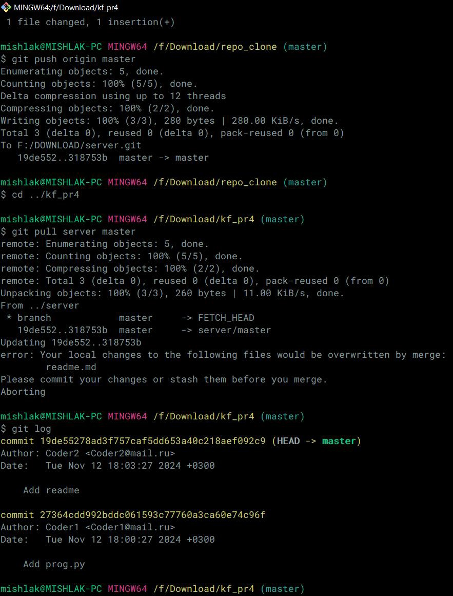
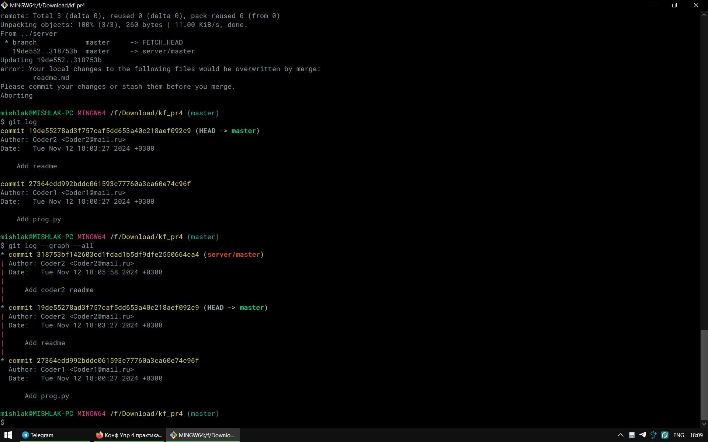
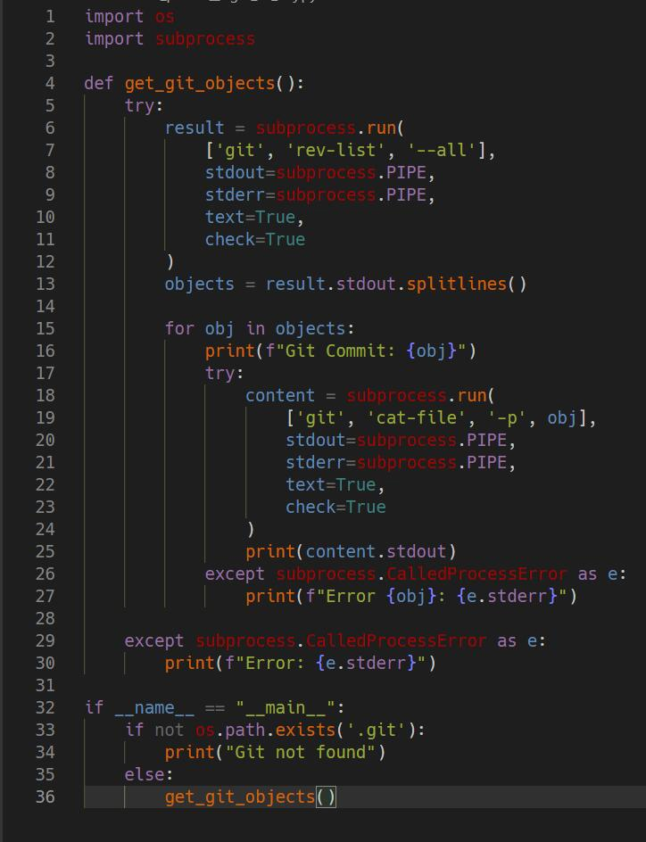
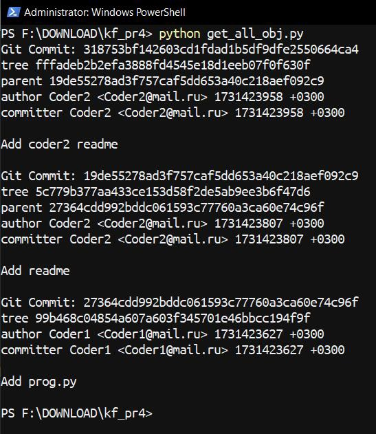

## Задача 1

На сайте http://git-school.github.io/visualizing-git/  с помощью команд эмулятора git получить следующее состояние проекта.

## Задача 2

Создать локальный git-репозиторий. Задать свои имя и почту (coder1). Разместить файл prog.py с какими-нибудь данными. Прислать в текстовом виде диалог с git.

## Задача 3

Создать рядом с локальным репозиторием bare-репозиторий с именем server. Загрузить туда содержимое локального репозитория. Команда git remote -v должна выдать информацию о server! Синхронизировать coder1 с server.

Клонировать репозиторий server в отдельной папке. Задать для работы с ним произвольные данные пользователя и почты (далее – coder2). Добавить файл readme.md с описанием программы. Обновить сервер.

Coder1 получает актуальные данные с сервера. Добавляет в readme в раздел об авторах свою информацию и обновляет сервер.

Coder2 добавляет в readme в раздел об авторах свою информацию и решает вопрос с конфликтами.

Прислать список набранных команд и содержимое git log.

## Задача 4

Написать программу на Питоне (или другом ЯП), которая выводит список содержимого всех объектов репозитория. Воспользоваться командой "git cat-file -p". Идеальное решение – не использовать иных сторонних команд и библиотек для работы с git.

